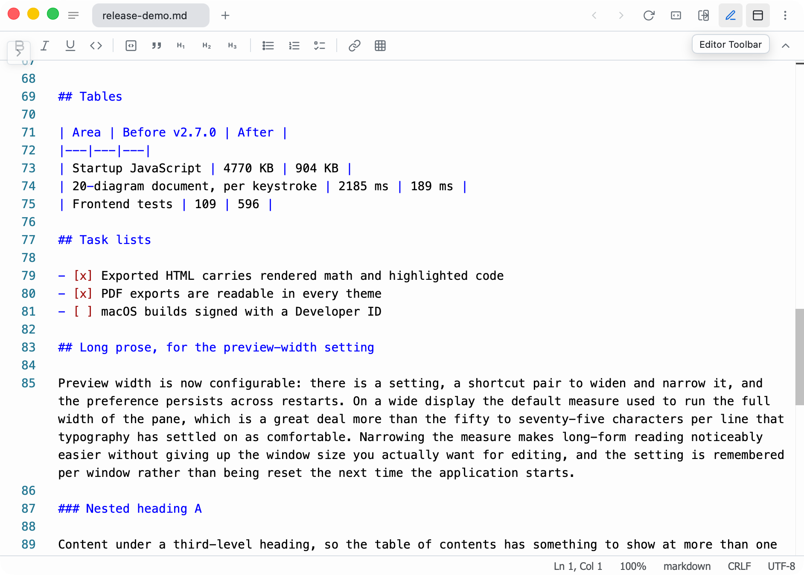
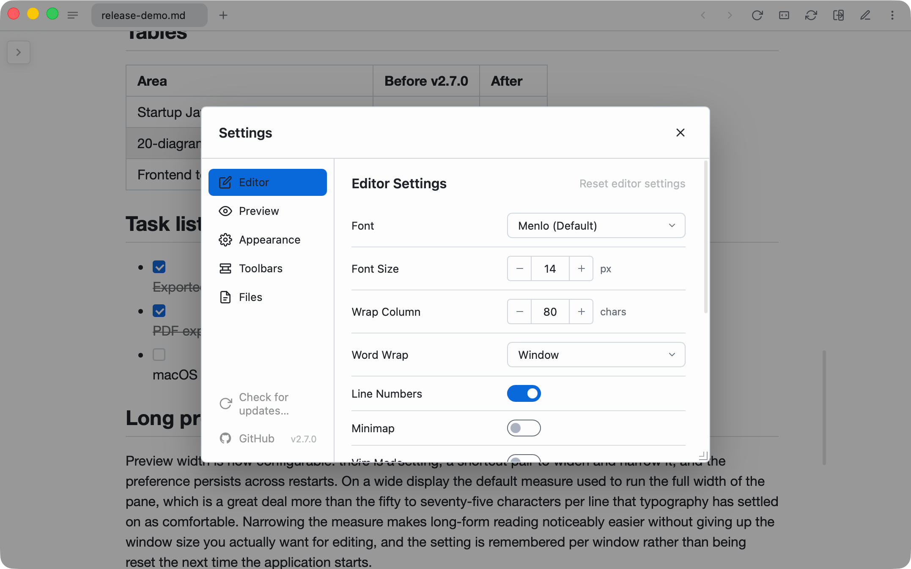
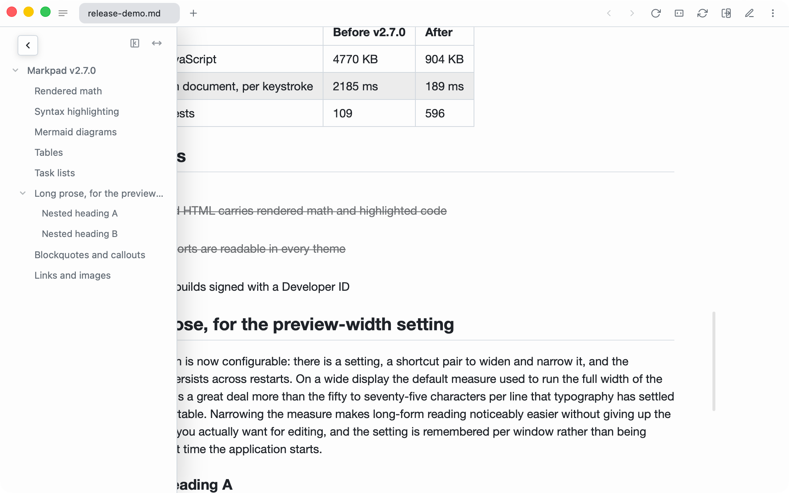
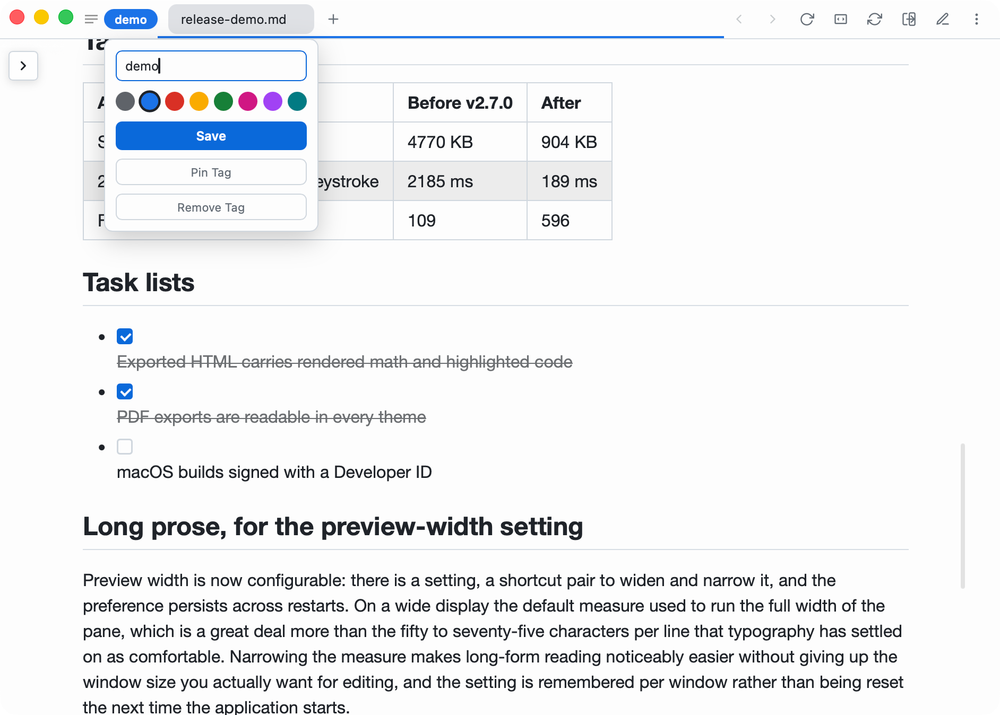

<div align="center">
  
  <h1>Markpad</h1>
  <p><b>The Notepad equivalent for Markdown</b></p>
  
  [](https://github.com/sftwrdotdev/Markpad/releases/latest)

  <p>A lightweight, minimalist Markdown viewer and text editor built for productivity across Windows, macOS, and Linux.</p>

  <a href="https://markpad.dev">Website</a> // <a href="https://github.com/sftwrdotdev/Markpad/releases/latest">Download Latest Release</a> // <a href="https://github.com/sftwrdotdev/Markpad/issues">Report a Bug</a>
</div>

<br />


## Features

- Tabbed interface
- Multi-window support
- Window tags and pinned sessions
- Monaco editor (like VS Code)
- Split view
- Customizable toolbar and title bar icons
- Multi-language support
- Syntax highlighting both in editor and code blocks
- Math equation support (KaTeX)
- Mermaid diagram support
- Vim mode
- Auto-reload from disk
- Zen mode
- Table of contents
- Configurable default mode for new files (editor or preview)
- Custom themes
- Paste images into editor
- Custom typography and font settings
- Content zooming
- Image embeds
- PDF and HTML export
- Familiar GitHub styled markdown rendering
- Tiny memory usage (~10MB)
- No telemetry or bloat
- Free and open-source
- Lightweight native UI
- Cross-platform (Windows, macOS, Linux)

## Installation

### Package Managers

#### Windows (Chocolatey)

```powershell
choco install markpad-app
```

#### Linux (Snap)

```bash
sudo snap install markpad 
```

### Direct Download

Download the latest executable or installer from the [releases page](https://github.com/alecdotdev/Markpad/releases/latest) or from [markpad.sftwr.dev](https://markpad.sftwr.dev)

> After a direct `.dmg` (macOS), `*-setup.exe` (Windows NSIS) or `.AppImage` (Linux) install, Markpad self-updates from GitHub releases via the in-app *Check for Updates…* entry (macOS app menu, or Settings elsewhere). Snap, Chocolatey, `.deb` and `.rpm` users continue to update through their distribution channels.

## Installation from source

- Clone the repository
- Run `npm install` to install dependencies
- Run `npm run tauri build` to build the executable 

### Isolated macOS test bundle

For local verification without opening or replacing `/Applications/Markpad.app`, build an unsigned test-only app with an independent identifier:

```bash
MARKPAD_TEST_BUNDLE_ID=dev.example.markpad.test npm run build:test-bundle
```

The result is placed in `dist/test-bundle/`. It is not a distributable release: it has no Developer ID notarization or Windows Authenticode signature.

## Issues & Feedback

If you find a bug, have a feature request, or just want to leave some feedback, please [open an issue](https://github.com/alecdotdev/Markpad/issues/new/choose). I'm actively developing Markpad and love hearing from users!

## Contributing

Contributions are always welcome! Markpad is built with SvelteKit and Tauri. 

1. **Fork & Clone** the repository
2. **Install dependencies**: `npm install`
3. **Run the dev server**: `npm run tauri dev` (to run the Tauri app locally)
4. **Make your changes** and ensure type checking passes: `npm run check`
5. **Open a Pull Request**!

Please ensure your code follows the existing style and that you add descriptions for any new features.

## Screenshots

#### Split view

#### Editor toolbar

#### Home page

#### Split view minimal

#### Code blocks

#### Light mode

#### Settings

#### Zen mode

#### Theme settings

#### Table of Contents

#### Theme example

#### Window tag

#### Drag and drop

